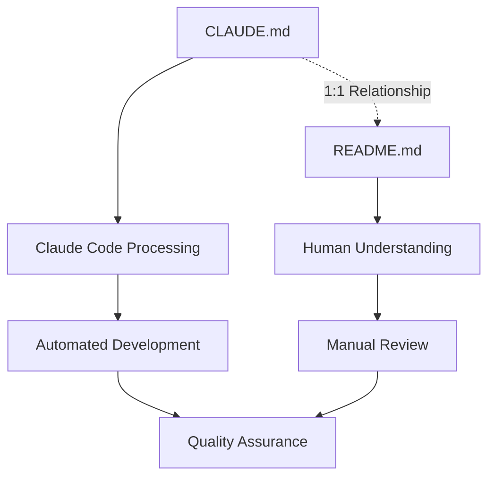

# CLAUDE.md

This file provides guidance to Claude Code (claude.ai/code) when working with code in this repository.

## Documentation Structure and Relationship

### CLAUDE.md - README.md Integration System

- **CLAUDE.md** (this file): Contains workflows and configurations for Claude Code to understand prompts and project structure
- **README.md**: Provides human-readable documentation that mirrors and explains the content in CLAUDE.md
- **1:1 Relationship**: CLAUDE.md and README.md maintain a one-to-one correspondence where each section in CLAUDE.md has an equivalent explanation in README.md

### Language Configuration

- **Default Language**: Japanese
- **README.md Language**: The README.md file uses the default language setting for all documentation
- **Translation Support**: Multi-language documentation provided through the docs/ directory structure

### Mermaid Visualization Workflow

The README.md file includes Mermaid diagrams to visualize:

- Project architecture overview
- Development workflow processes
- Component relationships
- WhisperKit integration patterns



## Claude 4 Best Practices Implementation

This project follows Claude 4 prompt engineering best practices with focus on:

**「小さなドラフト → 厳しい批評 → 再生成 → リリース」(Small draft → Critical review → Regenerate → Release)**

### Core Implementation Principles

1. **AI Review-First Design**: Use Claude as a "Senior Reviewer" rather than "Junior Designer"
2. **Structured Quality Assessment**: Security (HIGH) → SOLID Principles (MEDIUM) → Performance (LOW)
3. **Iterative Review Cycles**: 3-4 review iterations maximum with 400-character summaries
4. **Human Final Validation**: Always include human verification as the final step

### AI Review-First Implementation Workflow

#### Step 1: Minimal Implementation Draft

Create basic functionality with essential features:

```text
Context: Flutter WhisperKit integration project
Task: [Specific feature name]
Requirements:
- Essential functionality only
- Follow existing project patterns
- Use established dependencies and conventions
Output: Minimal working implementation
```

#### Step 2: AI Review Cycles (3-4 iterations)

**Review Template for All Code**:

```text
Review Request: [Brief description]

Apply Claude 4 AI Review-First methodology:

1. Security Analysis (HIGH Priority):
   - Hardcoded secrets/credentials scan
   - Input validation and sanitization
   - Secure data storage practices
   - Audio data handling security

2. Architecture Review (MEDIUM Priority):
   - SOLID principles compliance
   - Design pattern consistency
   - Separation of concerns
   - Code organization and structure

3. Performance Review (LOW Priority):
   - Audio processing optimization
   - Memory usage efficiency
   - Real-time processing capabilities
   - Build/runtime optimization

Format: Max 400 characters per category
Output: Specific actionable recommendations
Priority: Mark each issue as HIGH/MEDIUM/LOW
```

#### Step 3: Quality Gate Validation

All implementations must pass these gates:

```bash
# Security Gates (HIGH Priority)
- No hardcoded secrets: grep -r --exclude-dir=.git -E "(API_KEY|SECRET|PASSWORD|TOKEN|PRIVATE_KEY)" .
- Input validation implemented
- Secure storage patterns used

# Architecture Gates (MEDIUM Priority)
flutter analyze
flutter test

# Performance Gates (LOW Priority)
- No obvious bottlenecks identified
- Efficient audio processing patterns used
```

#### Step 4: Final Validation Checklist

- [ ] HIGH priority security issues: ✅ Resolved
- [ ] MEDIUM priority architecture issues: ✅ Addressed
- [ ] LOW priority performance issues: ✅ Optimized
- [ ] Static analysis: ✅ `flutter analyze` passes
- [ ] All tests: ✅ `flutter test` passes
- [ ] Code formatting: ✅ `dart format` applied
- [ ] Human validation: ✅ Final review completed

## Project Overview

This is a Flutter WhisperKit integration project that provides speech-to-text functionality using Apple's WhisperKit framework.

### Technology Stack

- **Framework**: Flutter (Single package structure)
- **Speech Recognition**: Apple WhisperKit
- **Platform**: iOS (primary), with potential Android support
- **Language**: Dart/Flutter for cross-platform, Swift for iOS native integration
- **Version Management**: Standard Flutter SDK
- **Testing**: Flutter test framework

## Project Structure

```
flutter_whisper_kit/
├── lib/                        # Flutter Dart code
│   ├── main.dart              # Application entry point
│   ├── models/                # Data models
│   ├── services/              # WhisperKit integration services
│   ├── ui/                    # User interface components
│   └── utils/                 # Utility functions
├── ios/                       # iOS-specific code
│   ├── Runner/                # iOS app configuration
│   └── Classes/               # Native iOS WhisperKit integration
├── android/                   # Android-specific code (future)
├── test/                      # Unit and widget tests
├── docs/                      # Documentation
│   ├── ja/                    # Japanese documentation
│   └── research/              # Research and technical documentation
├── packages/                  # Local packages (if any)
├── pubspec.yaml               # Flutter dependencies
├── package.json               # Node.js dependencies (commitlint)
└── commitlint.config.js       # Commit message linting
```

## Environment Setup

### Requirements

- Flutter SDK (latest stable)
- Xcode (for iOS development)
- CocoaPods (for iOS dependencies)
- Node.js/npm (for commitlint)
- Apple Developer Account (for WhisperKit access)

## Development Commands

### Flutter Commands

```bash
# Install dependencies
flutter pub get

# Run the application
flutter run

# Run tests
flutter test

# Static analysis
flutter analyze

# Format code
dart format .

# Build for iOS
flutter build ios
```

### Node.js Commands (Commitlint)

```bash
# Install commitlint dependencies
npm install

# Run commitlint
npx commitlint --edit

# Format documentation
npx prettier --write "**/*.md"
```

## Architecture Design

### WhisperKit Integration

- **Native Integration**: iOS platform channels for WhisperKit communication
- **Audio Processing**: Efficient audio data handling and processing
- **Model Management**: WhisperKit model loading and management
- **Real-time Processing**: Live audio transcription capabilities

### Flutter Architecture

- **State Management**: Provider or similar state management solution
- **Service Layer**: Abstraction for WhisperKit operations
- **UI Components**: Reusable widgets for speech recognition interface
- **Error Handling**: Comprehensive error handling and user feedback

## Development Guidelines

### Code Quality

- Follow Flutter/Dart style guidelines
- Use meaningful variable and function names
- Add comprehensive documentation for public APIs
- Include unit tests for all business logic
- Include widget tests for UI components

### Git Workflow

- Use [Conventional Commits](https://www.conventionalcommits.org/) format
- Include Japanese descriptions when appropriate
- Reference documentation in commit messages
- Use pull requests for all changes

### Testing Strategy

- Unit tests for business logic and services
- Widget tests for UI components
- Integration tests for WhisperKit integration
- Performance tests for audio processing

### Documentation

- Maintain 1:1 relationship between CLAUDE.md and README.md
- Include Japanese documentation in docs/ja/
- Document all public APIs and integration points
- Provide examples and usage patterns

## AI Review-First Quality Standards

All development must meet these criteria:

### 🔴 Security Standards (HIGH Priority)

- ✅ No hardcoded secrets/credentials
- ✅ Secure audio data handling
- ✅ Proper permission management
- ✅ Input validation for all user inputs
- ✅ Secure native bridge implementation

### 🟡 Architecture Standards (MEDIUM Priority)

- ✅ SOLID principles compliance
- ✅ Proper abstraction layers
- ✅ Clean separation between Flutter and native code
- ✅ Efficient state management
- ✅ Proper error handling patterns

### 🟢 Performance Standards (LOW Priority)

- ✅ Efficient audio processing
- ✅ Memory usage optimization
- ✅ Real-time processing capabilities
- ✅ Minimal UI lag during processing
- ✅ Optimized build times

## WhisperKit-Specific Considerations

### iOS Integration

- Proper WhisperKit framework integration
- Efficient audio data transfer between Flutter and native
- Model loading and management strategies
- Real-time processing optimization

### Audio Processing

- Efficient audio format handling
- Memory management for large audio files
- Streaming audio processing capabilities
- Error handling for audio processing failures

### User Experience

- Responsive UI during processing
- Clear feedback for users
- Proper handling of permissions
- Graceful degradation when WhisperKit is unavailable

---

**Note**: This file controls Claude Code behavior for WhisperKit integration development. Test thoroughly when making changes to ensure proper functionality.