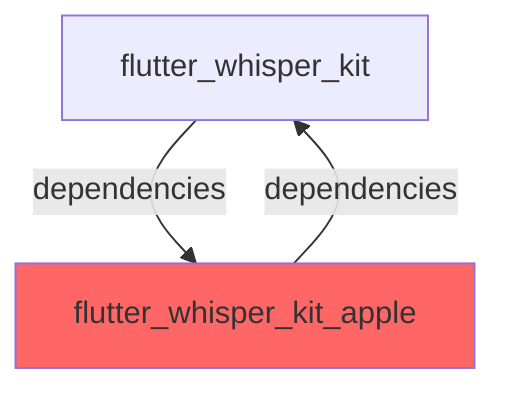
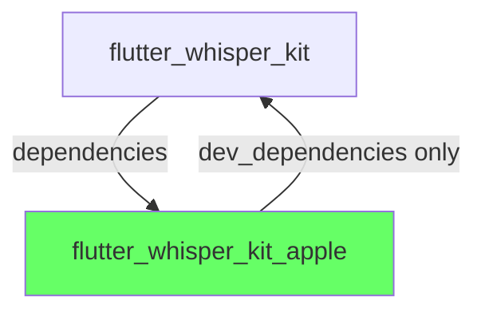
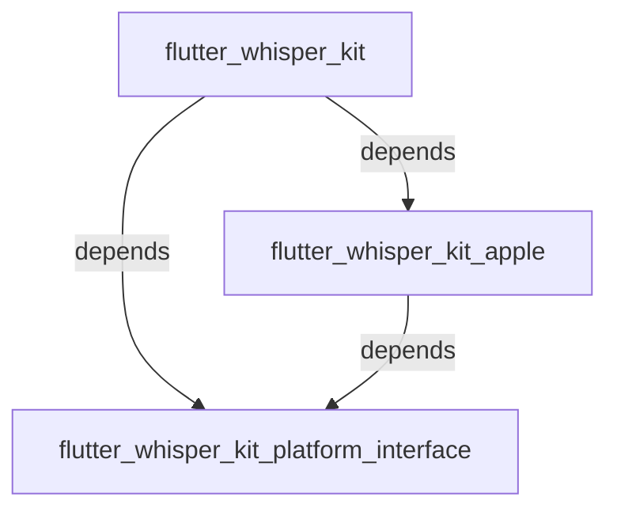
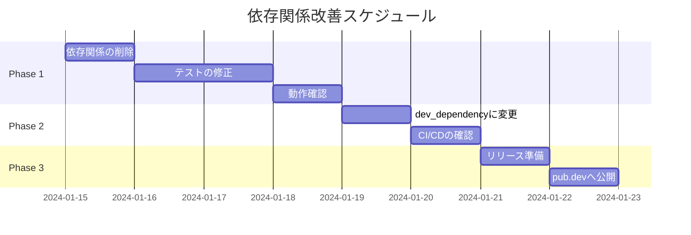

# Flutter WhisperKit 依存関係改善ガイド

## 現在の問題

### 循環依存関係



この構造は以下の問題を引き起こします：

- pub.dev への公開時の困難
- バージョン管理の複雑化
- ビルドエラーの可能性
- テストの独立性の欠如

## 推奨される改善案

### Option 1: 標準的なFlutterプラグインアーキテクチャ（推奨）



#### 実装手順

1. **flutter_whisper_kit_apple/pubspec.yaml を修正**

```yaml
# Before
dependencies:
  flutter_whisper_kit: 0.2.0 # 削除

# After
dev_dependencies:
  flutter_whisper_kit:
    path: ../flutter_whisper_kit # テスト用のみ
```

2. **テストの修正**

```dart
// flutter_whisper_kit_apple/test/flutter_whisper_kit_apple_test.dart

// Before
import 'package:flutter_whisper_kit/flutter_whisper_kit.dart';

// After - モックを使用
import 'package:flutter_test/flutter_test.dart';
import 'package:flutter_whisper_kit_apple/flutter_whisper_kit_apple.dart';

// 必要なインターフェースのモックを作成
abstract class MockWhisperKitPlatform {
  Future<void> initialize();
  // 他の必要なメソッド
}
```

### Option 2: Platform Interface パッケージの分離

より大規模なプロジェクトでは、インターフェースを別パッケージに分離：



#### 実装手順

1. **新しいパッケージを作成**

```bash
cd packages
flutter create --template=package flutter_whisper_kit_platform_interface
```

2. **インターフェースを移動**

```dart
// flutter_whisper_kit_platform_interface/lib/flutter_whisper_kit_platform_interface.dart
abstract class FlutterWhisperKitPlatform extends PlatformInterface {
  // インターフェース定義
}
```

3. **依存関係を更新**

```yaml
# flutter_whisper_kit/pubspec.yaml
dependencies:
  flutter_whisper_kit_platform_interface: ^0.2.0
  flutter_whisper_kit_apple: ^0.2.0

# flutter_whisper_kit_apple/pubspec.yaml
dependencies:
  flutter_whisper_kit_platform_interface: ^0.2.0
  # flutter_whisper_kit への依存を削除
```

## 懸念事項と対策

### 1. 既存のテストが壊れる可能性

**対策**: モックまたはスタブを使用してテストを書き直す

### 2. 型の共有が必要な場合

**対策**: 共通の型は platform_interface パッケージに配置

### 3. リリースプロセスの変更

**対策**:

- Option 1: 依存関係が一方向なので、通常のリリースフローで対応可能
- Option 2: platform_interface → apple → main の順でリリース

### 4. 破壊的変更の可能性

**対策**: パッケージ利用者への影響は最小限（内部実装の変更のみ）

## 移行スケジュール案



## 推奨事項

1. **Option 1 を採用することを推奨**
   - シンプルで標準的なアプローチ
   - 追加パッケージが不要
   - 移行が容易

2. **段階的な移行**
   - まず循環依存を解消
   - テストを修正
   - 動作確認後にリリース

3. **将来の拡張性**
   - 他のプラットフォーム（Android、Windows等）を追加する場合は Option 2 を検討

## 結論

現在の循環依存関係は Flutter プラグインの標準的なパターンから逸脱しており、改善が必要です。Option 1 の採用により、以下のメリットが得られます：

- ✅ pub.dev への公開が容易に
- ✅ バージョン管理がシンプルに
- ✅ テストの独立性が向上
- ✅ 標準的なFlutterプラグイン構造に準拠
