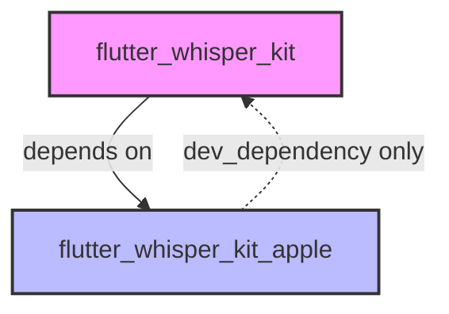
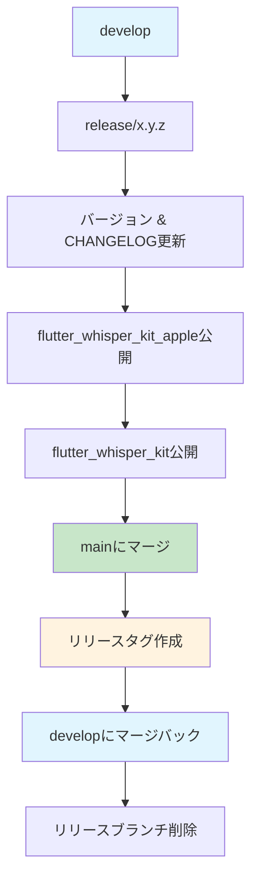

# Flutter WhisperKit リリースフロー

このドキュメントは、依存関係改善ガイドの**Option 1**を使用して循環依存関係を解決した後、git-flow手法を使用して`flutter_whisper_kit`と`flutter_whisper_kit_apple`パッケージをpub.devに公開するリリースプロセスを説明します。

## Option 1実装の主な利点

✅ **循環依存関係なし** - Flutterプラグイン標準に従ったクリーンなアーキテクチャ  
✅ **簡素化されたリリースプロセス** - 依存関係の一時的な修正が不要  
✅ **pub.dev互換性** - 依存関係の問題なしでパッケージを公開可能  
✅ **独立したバージョン管理** - 各パッケージを独立してバージョン管理可能  
✅ **改善されたCI/CD** - 自動化ワークフローがよりシンプルで信頼性向上

## パッケージ依存関係（Option 1実装後）



- **flutter_whisper_kit**: プラットフォーム実装として`flutter_whisper_kit_apple`に依存するメインパッケージ
- **flutter_whisper_kit_apple**: テスト用の**dev_dependencyのみ**として`flutter_whisper_kit`を持つプラットフォーム固有パッケージ

## Git-Flowブランチ構造

このプロジェクトは構造化されたリリース管理のためgit-flow手法を使用します：

### ブランチタイプ

- **main**: 本番リリース用ブランチ
- **develop**: フィーチャーの統合ブランチ
- **feature/\***: フィーチャー開発ブランチ
- **release/\***: リリース準備ブランチ
- **hotfix/\***: 本番環境の緊急修正用

### 現在のブランチ状態

```bash
git branch -a
# 出力例:
# * develop         # 現在の開発ブランチ
# main             # 本番ブランチ
# feature/*        # フィーチャーブランチ
```

## リリース戦略（Git-Flow + 循環依存関係なし）

循環依存関係が解決され、git-flow手法により、**構造化されたリリースプロセス**を使用します：

### Git-Flowリリースプロセス

パッケージ依存関係でgit-flow手法に従って：

1. **developからリリースブランチを作成**
2. **flutter_whisper_kit_appleを最初にリリース**（プラットフォーム実装）
3. **flutter_whisper_kitをリリース**（メインパッケージ）
4. **mainにマージしてリリースタグを作成**
5. **developにマージバック**

### 主な利点

- dev_dependenciesの一時的な削除が不要
- pub.devが依存関係を正しく解決可能
- よりシンプルなCI/CDパイプライン
- 独立したバージョン管理

### Git-Flowリリースワークフロー

すべてのリリースでgit-flowプロセスに従います：



## 詳細なGit-Flowリリース手順

### フェーズ1：リリースブランチ準備

#### ステップ1：リリースブランチ作成

```bash
# developブランチで最新状態であることを確認
git checkout develop
git pull origin develop

# リリースブランチ作成（例：release/0.2.0）
git checkout -b release/0.2.0

# リリースブランチをプッシュ
git push -u origin release/0.2.0
```

#### ステップ2：リリース前チェックリスト

- [ ] すべてのテストが成功：`mise run test`
- [ ] 静的解析がクリーン：`mise run analyze`
- [ ] バージョンと日付でChangelogが更新済み
- [ ] pubspec.yamlのバージョンが更新済み
- [ ] APIドキュメントが更新済み
- [ ] 全プラットフォームでサンプルアプリがテスト済み

### フェーズ2：パッケージ公開

#### ステップ3：flutter_whisper_kit_appleのリリース

```bash
cd packages/flutter_whisper_kit_apple

# 1. pubspec.yamlのバージョンを更新
# version: 0.2.0

# 2. CHANGELOG.mdを更新
# 適切なフォーマットでリリースノートを追加

# 3. 品質チェック実行
mise run analyze
mise run test

# 4. 変更をコミット
git add .
git commit -m "chore: prepare flutter_whisper_kit_apple v0.2.0 for release"

# 5. 公開のドライラン実行
flutter pub publish --dry-run

# 6. 公開
flutter pub publish

# 注意：パス依存関係を使用しているためdev_dependenciesの修正は不要
```

#### ステップ4：flutter_whisper_kitのリリース

```bash
cd packages/flutter_whisper_kit

# 1. pubspec.yamlの依存関係バージョンを更新
# dependencies:
#   flutter_whisper_kit_apple: ^0.2.0  # 公開されたバージョンを使用

# 2. pubspec.yamlのバージョンを更新
# version: 0.2.0

# 3. CHANGELOG.mdを更新

# 4. 品質チェック実行
mise run analyze
mise run test

# 5. サンプルアプリをテスト
cd example
flutter run

# 6. 変更をコミット
git add .
git commit -m "chore: prepare flutter_whisper_kit v0.2.0 for release"

# 7. 公開のドライラン実行
flutter pub publish --dry-run

# 8. 公開
flutter pub publish
```

### フェーズ3：Git-Flow完了

#### ステップ5：リリースブランチの完了

```bash
# 1. リリースブランチにすべてのリリース変更をコミット
git add .
git commit -m "chore: finalize release v0.2.0"

# 2. リリースブランチをmainにマージ
git checkout main
git pull origin main
git merge --no-ff release/0.2.0
git push origin main

# 3. main上で両パッケージのgitタグを作成
git tag flutter_whisper_kit-v0.2.0
git tag flutter_whisper_kit_apple-v0.2.0
git push origin flutter_whisper_kit-v0.2.0
git push origin flutter_whisper_kit_apple-v0.2.0

# 4. developにマージバック
git checkout develop
git pull origin develop
git merge --no-ff main
git push origin develop

# 5. リリースブランチを削除（オプションですが推奨）
git branch -d release/0.2.0
git push origin --delete release/0.2.0

# 6. GitHubリリースを作成
gh release create flutter_whisper_kit-v0.2.0 --title "flutter_whisper_kit v0.2.0" --notes "詳細はCHANGELOG.mdを参照"
gh release create flutter_whisper_kit_apple-v0.2.0 --title "flutter_whisper_kit_apple v0.2.0" --notes "詳細はCHANGELOG.mdを参照"
```

#### ステップ6：リリース後のタスク

```bash
# 継続的な開発のためにdevelopに戻る
git checkout develop

# ブランチが同期されていることを確認
git log --oneline --graph --all -10

# 必要に応じて次のフィーチャー開発を継続
git checkout -b feature/next-feature
```

## バージョン管理

### バージョニング戦略

可能な限り両パッケージは同期されたバージョンを維持すべきです：

- メジャーバージョンの変更は協調して行う
- マイナーバージョンとパッチバージョンは特定の変更に基づいて分岐可能

### バージョン制約

```yaml
# flutter_whisper_kit/pubspec.yaml
dependencies:
  flutter_whisper_kit_apple: ^0.2.0 # マイナーアップデートを許可

# flutter_whisper_kit_apple/pubspec.yaml
dev_dependencies:
  flutter_whisper_kit: ^0.2.0 # マイナーアップデートを許可
```

## GitHub Actionsによる自動化

### Git-Flowリリース自動化（.github/workflows/release.yml）

```yaml
name: Git-Flow Release

on:
  push:
    tags:
      - "flutter_whisper_kit-v*"
      - "flutter_whisper_kit_apple-v*"

jobs:
  release:
    runs-on: ubuntu-latest
    steps:
      - uses: actions/checkout@v4
        with:
          fetch-depth: 0 # git-flow操作に必要

      - name: Setup Flutter
        uses: subosito/flutter-action@v2
        with:
          flutter-version: "3.35.2"

      - name: Install dependencies
        run: |
          flutter pub get
          cd packages/flutter_whisper_kit && flutter pub get
          cd ../flutter_whisper_kit_apple && flutter pub get

      - name: Validate git-flow state
        run: |
          # リリース用にmainブランチにいることを確認
          git checkout main

          # タグがmainブランチに存在することを確認
          if ! git tag --merged main | grep -q "${{ github.ref_name }}"; then
            echo "Error: Tag ${{ github.ref_name }} is not on main branch"
            exit 1
          fi

      - name: Run tests
        run: mise run test

      - name: Publish to pub.dev
        env:
          PUB_CREDENTIALS: ${{ secrets.PUB_CREDENTIALS }}
        run: |
          # タグに基づいて公開するパッケージを決定
          if [[ ${{ github.ref_name }} == flutter_whisper_kit_apple-v* ]]; then
            cd packages/flutter_whisper_kit_apple
          elif [[ ${{ github.ref_name }} == flutter_whisper_kit-v* ]]; then
            cd packages/flutter_whisper_kit
          fi

          flutter pub publish --force

      - name: Create GitHub Release
        env:
          GITHUB_TOKEN: ${{ secrets.GITHUB_TOKEN }}
        run: |
          gh release create ${{ github.ref_name }} \
            --title "${{ github.ref_name }}" \
            --notes "詳細はCHANGELOG.mdを参照" \
            --generate-notes
```

## トラブルシューティング（Option 1）

### 一般的な問題

1. **依存関係解決エラー**
   - 解決策：flutter_whisper_kit_appleがflutter_whisper_kitに依存関係を持たないことを確認
   - 確認事項：パス参照でのdev_dependenciesのみが許可されている

2. **循環依存関係削除後のテスト失敗**
   - 解決策：テストが適切なモックを使用していることを確認
   - パス参照でのDev_dependencyにより、テストは必要な型にアクセス可能

3. **バージョン競合**
   - 解決策：常にプラットフォームパッケージ（apple）を最初にリリースし、次にメインパッケージ
   - 適切なバージョン制約を使用（マイナーアップデートには^を使用）

4. **pub.devスコアの問題**
   - 解決策：pubspec.yamlで適切なプラットフォーム宣言を確認
   - サンプルアプリが含まれ機能することを確認

### 緊急ロールバック

リリースに問題がある場合：

1. **バージョンの撤回**（重要な場合）：

   ```bash
   flutter pub retract <package-name> <version>
   ```

2. **修正を含むパッチバージョンを即座に公開**

3. **必要に応じて依存パッケージの制約を更新**

## ベストプラクティス

1. **リリース前に常にサンプルアプリをテスト**
2. **パッケージ内容を確認するためにdry-runを使用**
3. **破壊的変更をCHANGELOGで明確に文書化**
4. **パッケージ間のリリースを協調**
5. **追跡のためgitでリリースにタグ付け**
6. **リリース後にpub.devでスコア更新を監視**

## Git-Flowリリースチェックリストテンプレート

```markdown
## Git-Flow リリースチェックリスト v0.2.0用

### フェーズ1：リリースブランチ準備

- [ ] developからリリースブランチ作成：`git checkout -b release/0.2.0`
- [ ] リリースブランチをプッシュ：`git push -u origin release/0.2.0`
- [ ] リリースブランチでCIチェックがすべて成功
- [ ] 両パッケージのCHANGELOG.mdが更新済み
- [ ] 両パッケージのpubspec.yamlでバージョンが更新済み
- [ ] iOS/macOSでサンプルアプリがテスト済み
- [ ] ドキュメントが更新済み
- [ ] flutter_whisper_kit_appleに循環依存関係がないことを確認

### フェーズ2：パッケージ公開

#### flutter_whisper_kit_apple（最初にリリース）

- [ ] pubspec.yamlのバージョン：0.2.0
- [ ] `mise run analyze` 実行 - 成功必須
- [ ] `mise run test` 実行 - 成功必須
- [ ] `flutter pub publish --dry-run` 実行 - 成功必須
- [ ] pub.devに公開：`flutter pub publish`
- [ ] pub.devで確認 - パッケージが表示される
- [ ] pub点数をチェックして問題を解決

#### flutter_whisper_kit（2番目にリリース）

- [ ] pubspec.yamlのバージョン：0.2.0
- [ ] flutter_whisper_kit_apple依存関係を^0.2.0に更新
- [ ] `mise run analyze` 実行 - 成功必須
- [ ] `mise run test` 実行 - 成功必須
- [ ] サンプルアプリをテスト - 動作必須
- [ ] `flutter pub publish --dry-run` 実行 - 成功必須
- [ ] pub.devに公開：`flutter pub publish`
- [ ] pub.devで確認 - パッケージが表示される
- [ ] pub点数をチェックして問題を解決

### フェーズ3：Git-Flow完了

- [ ] すべてのリリース変更をコミット：`git commit -m "chore: finalize release v0.2.0"`
- [ ] mainにマージ：`git checkout main && git merge --no-ff release/0.2.0`
- [ ] mainをプッシュ：`git push origin main`
- [ ] gitタグ作成：`git tag flutter_whisper_kit-v0.2.0 && git tag flutter_whisper_kit_apple-v0.2.0`
- [ ] タグをプッシュ：`git push origin --tags`
- [ ] developにマージバック：`git checkout develop && git merge --no-ff main`
- [ ] developをプッシュ：`git push origin develop`
- [ ] リリースブランチ削除：`git branch -d release/0.2.0 && git push origin --delete release/0.2.0`
- [ ] `gh release create`でGitHubリリース作成
- [ ] プロジェクトボード/issuesを更新
- [ ] リリースを告知（該当する場合）

### リリース後の確認

- [ ] 両パッケージがpub.devで表示される
- [ ] タグがGitHubで表示される
- [ ] リリースがGitHubで公開されている
- [ ] mainとdevelopブランチが同期されている
- [ ] 次の開発サイクルの準備完了
```

## リリース後の開発ワークフロー

リリース後の継続的な開発について：

1. **flutter_whisper_kit_apple** はパス依存関係を継続使用：

   ```yaml
   dev_dependencies:
     flutter_whisper_kit:
       path: ../flutter_whisper_kit
   ```

2. **利点**：
   - テストは常に最新のローカル変更に対して実行
   - 開発中の変更ごとに公開する必要がない
   - より簡単な統合テスト

3. **重要**：パス依存関係は dev_dependencies でのみ使用し、通常の dependencies では決して使用しない
