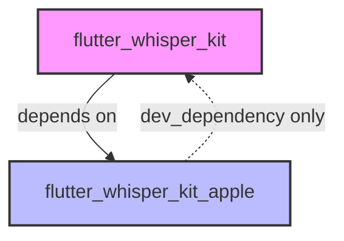

# Flutter WhisperKit Release Flow

This document describes the release process for publishing `flutter_whisper_kit` and `flutter_whisper_kit_apple` packages to pub.dev after resolving circular dependencies using **Option 1** from the dependency improvement guide.

## Key Benefits of Option 1 Implementation

✅ **No circular dependencies** - Cleaner architecture following Flutter plugin standards  
✅ **Simplified release process** - No need to temporarily modify dependencies  
✅ **pub.dev compatibility** - Packages can be published without dependency issues  
✅ **Independent versioning** - Each package can be versioned independently  
✅ **Better CI/CD** - Automated workflows are simpler and more reliable

## Package Dependencies (After Option 1 Implementation)



- **flutter_whisper_kit**: Main package that depends on `flutter_whisper_kit_apple` as a platform implementation
- **flutter_whisper_kit_apple**: Platform-specific package that has `flutter_whisper_kit` as a **dev_dependency only** for testing

## Release Strategy (Option 1 - No Circular Dependencies)

With the circular dependency resolved, we can use a **simplified release process**:

### Standard Release Process

Since there are no circular dependencies, releases follow a straightforward order:

1. **Release flutter_whisper_kit_apple first** (platform implementation)
2. **Release flutter_whisper_kit** (main package)

### Key Benefits

- No need to temporarily remove dev_dependencies
- pub.dev can resolve dependencies correctly
- Simpler CI/CD pipeline
- Independent version management

### Subsequent Releases

For updates after initial release, follow the dependency order:


## Detailed Release Steps

### Pre-release Checklist

- [ ] All tests pass: `mise run test`
- [ ] Static analysis clean: `mise run analyze`
- [ ] Changelog updated with version and date
- [ ] Version bumped in pubspec.yaml
- [ ] API documentation updated
- [ ] Example app tested on all platforms

### Step 1: Release flutter_whisper_kit_apple

```bash
cd packages/flutter_whisper_kit_apple

# 1. Update version in pubspec.yaml
# version: 0.2.0

# 2. Update CHANGELOG.md
# Add release notes with proper formatting

# 3. Run quality checks
mise run analyze
mise run test

# 4. Commit changes
git add .
git commit -m "chore: prepare flutter_whisper_kit_apple v0.2.0 for release"

# 5. Publish dry run
flutter pub publish --dry-run

# 6. Publish
flutter pub publish

# Note: No need to modify dev_dependencies since we're using path dependency
```

### Step 2: Release flutter_whisper_kit

```bash
cd packages/flutter_whisper_kit

# 1. Update dependency version in pubspec.yaml
# dependencies:
#   flutter_whisper_kit_apple: ^0.2.0  # Use published version

# 2. Update version in pubspec.yaml
# version: 0.2.0

# 3. Update CHANGELOG.md

# 4. Run quality checks
mise run analyze
mise run test

# 5. Test example app
cd example
flutter run

# 6. Commit changes
git add .
git commit -m "chore: prepare flutter_whisper_kit v0.2.0 for release"

# 7. Publish dry run
flutter pub publish --dry-run

# 8. Publish
flutter pub publish
```

### Step 3: Post-release Updates

```bash
# 1. Create git tags for both packages
git tag flutter_whisper_kit-v0.2.0
git tag flutter_whisper_kit_apple-v0.2.0

# 2. Push tags
git push origin flutter_whisper_kit-v0.2.0
git push origin flutter_whisper_kit_apple-v0.2.0

# 3. Create GitHub release
gh release create flutter_whisper_kit-v0.2.0 --title "flutter_whisper_kit v0.2.0" --notes "See CHANGELOG.md for details"
gh release create flutter_whisper_kit_apple-v0.2.0 --title "flutter_whisper_kit_apple v0.2.0" --notes "See CHANGELOG.md for details"

# Note: flutter_whisper_kit_apple keeps using path dependency for development
# This ensures tests always run against the latest local changes
```

## Version Management

### Versioning Strategy

Both packages should maintain synchronized versions when possible:

- Major version changes should be coordinated
- Minor and patch versions can diverge based on specific changes

### Version Constraints

```yaml
# flutter_whisper_kit/pubspec.yaml
dependencies:
  flutter_whisper_kit_apple: ^0.2.0 # Allow minor updates

# flutter_whisper_kit_apple/pubspec.yaml
dev_dependencies:
  flutter_whisper_kit: ^0.2.0 # Allow minor updates
```

## Automation with GitHub Actions

### Release Workflow (.github/workflows/release.yml)

```yaml
name: Release

on:
  push:
    tags:
      - "flutter_whisper_kit-v*"
      - "flutter_whisper_kit_apple-v*"

jobs:
  release:
    runs-on: ubuntu-latest
    steps:
      - uses: actions/checkout@v4

      - name: Setup Flutter
        uses: subosito/flutter-action@v2
        with:
          flutter-version: "3.27.2"

      - name: Install dependencies
        run: |
          flutter pub get
          cd packages/flutter_whisper_kit && flutter pub get
          cd ../flutter_whisper_kit_apple && flutter pub get

      - name: Run tests
        run: mise run test

      - name: Publish to pub.dev
        env:
          PUB_CREDENTIALS: ${{ secrets.PUB_CREDENTIALS }}
        run: |
          # Determine which package to publish based on tag
          if [[ $GITHUB_REF == refs/tags/flutter_whisper_kit_apple-v* ]]; then
            cd packages/flutter_whisper_kit_apple
          elif [[ $GITHUB_REF == refs/tags/flutter_whisper_kit-v* ]]; then
            cd packages/flutter_whisper_kit
          fi

          flutter pub publish --force
```

## Troubleshooting (Option 1)

### Common Issues

1. **Dependency resolution error**
   - Solution: Ensure flutter_whisper_kit_apple has NO dependency on flutter_whisper_kit
   - Check: Only dev_dependencies with path reference is allowed

2. **Test failures after removing circular dependency**
   - Solution: Ensure tests are using proper mocks
   - Dev_dependency with path ensures tests can still access needed types

3. **Version conflict**
   - Solution: Always release platform package (apple) first, then main package
   - Use appropriate version constraints (^ for minor updates)

4. **pub.dev score issues**
   - Solution: Ensure proper platform declarations in pubspec.yaml
   - Check that example app is included and functional

### Emergency Rollback

If a release has issues:

1. **Retract version** (if critical):

   ```bash
   flutter pub retract <package-name> <version>
   ```

2. **Publish patch version** with fixes immediately

3. **Update constraints** in dependent packages if needed

## Best Practices

1. **Always test example app** before release
2. **Use dry-run** to verify package contents
3. **Document breaking changes** clearly in CHANGELOG
4. **Coordinate releases** between packages
5. **Tag releases** in git for tracking
6. **Monitor pub.dev** after release for score updates

## Release Checklist Template (Option 1)

```markdown
## Release Checklist for v0.2.0

### Pre-release

- [ ] All CI checks passing
- [ ] CHANGELOG.md updated for both packages
- [ ] Version bumped in pubspec.yaml for both packages
- [ ] Example app tested on iOS/macOS
- [ ] Documentation updated
- [ ] Ensure flutter_whisper_kit_apple has NO circular dependencies

### flutter_whisper_kit_apple (Release First)

- [ ] Version: 0.2.0
- [ ] Run `mise run analyze`
- [ ] Run `mise run test`
- [ ] Run `flutter pub publish --dry-run`
- [ ] Publish to pub.dev
- [ ] Verify on pub.dev
- [ ] Check pub points and resolve any issues

### flutter_whisper_kit (Release Second)

- [ ] Version: 0.2.0
- [ ] Update flutter_whisper_kit_apple dependency to ^0.2.0
- [ ] Run `mise run analyze`
- [ ] Run `mise run test`
- [ ] Test example app
- [ ] Run `flutter pub publish --dry-run`
- [ ] Publish to pub.dev
- [ ] Verify on pub.dev
- [ ] Check pub points and resolve any issues

### Post-release

- [ ] Create git tags for both packages
- [ ] Push tags to GitHub
- [ ] Create GitHub releases
- [ ] Update project board/issues
- [ ] Announce release (if applicable)
```

## Development Workflow After Release

For ongoing development after release:

1. **flutter_whisper_kit_apple** continues to use path dependency:

   ```yaml
   dev_dependencies:
     flutter_whisper_kit:
       path: ../flutter_whisper_kit
   ```

2. **Benefits**:
   - Tests always run against latest local changes
   - No need to publish for every change during development
   - Easier integration testing

3. **Important**: The path dependency is ONLY in dev_dependencies, never in regular dependencies
