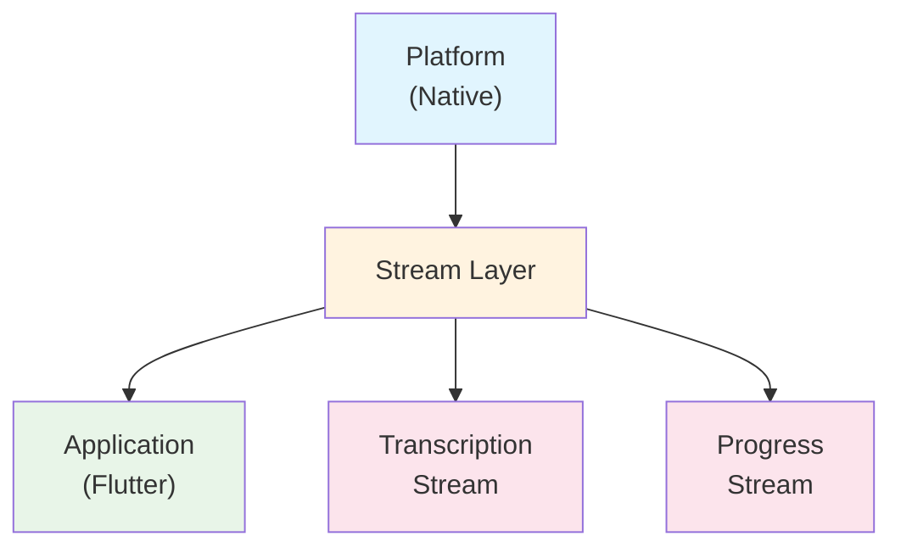

# ADR-004: Stream Management

## Status

Accepted

## Date

2024-12-29

## Context

Flutter WhisperKit handles real-time audio processing and transcription, requiring sophisticated stream management for:

1. **Real-time transcription results**: Continuous flow of transcription data during recording
2. **Download progress updates**: Progress tracking for model downloads
3. **Audio buffer management**: Handling continuous audio data streams
4. **State synchronization**: Coordinating multiple concurrent streams
5. **Memory management**: Preventing memory leaks from long-running streams
6. **Backpressure handling**: Managing high-frequency data without overwhelming consumers

The existing stream implementation had several challenges:

- No backpressure handling for high-frequency updates
- Memory leaks from uncanceled subscriptions
- Lack of buffering strategies for different use cases
- Inconsistent error propagation across streams

## Decision

We implemented a **Reactive Stream Architecture** with buffering, backpressure handling, and proper resource management:

### 1. Stream Architecture Overview



### 2. Core Stream Components

#### Base Stream Controller

```dart
abstract class WhisperKitStreamController<T> {
  final StreamController<T> _controller;
  final StreamSubscription? _platformSubscription;
  bool _disposed = false;

  WhisperKitStreamController() : _controller = StreamController.broadcast();

  Stream<T> get stream => _controller.stream;

  void emit(T event) {
    if (!_disposed && !_controller.isClosed) {
      _controller.add(event);
    }
  }

  void emitError(Object error, [StackTrace? stackTrace]) {
    if (!_disposed && !_controller.isClosed) {
      _controller.addError(error, stackTrace);
    }
  }

  Future<void> dispose() async {
    _disposed = true;
    await _platformSubscription?.cancel();
    await _controller.close();
  }
}
```

#### Transcription Stream Management

```dart
class TranscriptionStreamController extends WhisperKitStreamController<TranscriptionResult> {
  final Duration _debounceTime;
  Timer? _debounceTimer;
  TranscriptionResult? _lastResult;

  TranscriptionStreamController({
    Duration debounceTime = const Duration(milliseconds: 100),
  }) : _debounceTime = debounceTime;

  void emitTranscription(TranscriptionResult result) {
    _lastResult = result;
    _debounceTimer?.cancel();

    _debounceTimer = Timer(_debounceTime, () {
      if (_lastResult != null) {
        emit(_lastResult!);
      }
    });
  }

  @override
  Future<void> dispose() async {
    _debounceTimer?.cancel();
    await super.dispose();
  }
}
```

### 3. Buffered Stream Implementation

```dart
enum BufferStrategy {
  /// Drop old events when buffer is full
  dropOldest,
  /// Drop newest events when buffer is full
  dropNewest,
  /// Keep only the latest event
  latest,
  /// Emit all events (no buffering)
  unbuffered,
}

class BufferedTranscriptionStream {
  final int maxBufferSize;
  final BufferStrategy strategy;
  final Queue<TranscriptionResult> _buffer = Queue();
  final StreamController<TranscriptionResult> _controller;

  BufferedTranscriptionStream({
    this.maxBufferSize = 10,
    this.strategy = BufferStrategy.latest,
  }) : _controller = StreamController.broadcast();

  Stream<TranscriptionResult> get stream => _controller.stream;

  void add(TranscriptionResult result) {
    switch (strategy) {
      case BufferStrategy.dropOldest:
        _addWithDropOldest(result);
        break;
      case BufferStrategy.dropNewest:
        _addWithDropNewest(result);
        break;
      case BufferStrategy.latest:
        _addLatestOnly(result);
        break;
      case BufferStrategy.unbuffered:
        _controller.add(result);
        break;
    }
  }

  void _addWithDropOldest(TranscriptionResult result) {
    if (_buffer.length >= maxBufferSize) {
      _buffer.removeFirst();
    }
    _buffer.addLast(result);
    _controller.add(result);
  }

  void _addLatestOnly(TranscriptionResult result) {
    _buffer.clear();
    _buffer.addLast(result);
    _controller.add(result);
  }
}
```

### 4. Progress Stream with Throttling

```dart
class ProgressStreamController extends WhisperKitStreamController<Progress> {
  final Duration _throttleInterval;
  DateTime _lastEmission = DateTime(0);

  ProgressStreamController({
    Duration throttleInterval = const Duration(milliseconds: 200),
  }) : _throttleInterval = throttleInterval;

  void emitProgress(Progress progress) {
    final now = DateTime.now();
    if (now.difference(_lastEmission) >= _throttleInterval || progress.isComplete) {
      _lastEmission = now;
      emit(progress);
    }
  }
}
```

### 5. Stream Event Types

```dart
abstract class TranscriptionEvent {
  const TranscriptionEvent();
}

class TranscriptionResultEvent extends TranscriptionEvent {
  final TranscriptionResult result;
  const TranscriptionResultEvent(this.result);
}

class TranscriptionProgressEvent extends TranscriptionEvent {
  final double progress;
  const TranscriptionProgressEvent(this.progress);
}

class TranscriptionErrorEvent extends TranscriptionEvent {
  final WhisperKitError error;
  const TranscriptionErrorEvent(this.error);
}

class TranscriptionStateEvent extends TranscriptionEvent {
  final TranscriptionState state;
  const TranscriptionStateEvent(this.state);
}
```

### 6. Unified Event Stream

```dart
class UnifiedTranscriptionStream {
  final StreamController<TranscriptionEvent> _controller;

  UnifiedTranscriptionStream() : _controller = StreamController.broadcast();

  /// All transcription events
  Stream<TranscriptionEvent> get events => _controller.stream;

  /// Filtered streams for specific event types
  Stream<TranscriptionResult> get results => events
    .where((event) => event is TranscriptionResultEvent)
    .map((event) => (event as TranscriptionResultEvent).result);

  Stream<double> get progress => events
    .where((event) => event is TranscriptionProgressEvent)
    .map((event) => (event as TranscriptionProgressEvent).progress);

  Stream<WhisperKitError> get errors => events
    .where((event) => event is TranscriptionErrorEvent)
    .map((event) => (event as TranscriptionErrorEvent).error);

  Stream<TranscriptionState> get state => events
    .where((event) => event is TranscriptionStateEvent)
    .map((event) => (event as TranscriptionStateEvent).state);
}
```

## Implementation Details

### Memory Management Strategy

```dart
class StreamResourceManager {
  final Set<StreamSubscription> _subscriptions = {};
  bool _disposed = false;

  void addSubscription(StreamSubscription subscription) {
    if (!_disposed) {
      _subscriptions.add(subscription);
    }
  }

  Future<void> dispose() async {
    _disposed = true;
    final futures = _subscriptions.map((sub) => sub.cancel());
    await Future.wait(futures);
    _subscriptions.clear();
  }
}
```

### Error Recovery in Streams

```dart
extension StreamErrorRecovery<T> on Stream<T> {
  Stream<T> withErrorRecovery({
    int maxRetries = 3,
    Duration retryDelay = const Duration(seconds: 1),
  }) {
    return handleError((error, stackTrace) {
      // Log error and attempt recovery
      logger.warning('Stream error: $error', error, stackTrace);

      // Implement exponential backoff retry
      return Future.delayed(retryDelay).then((_) {
        // Recovery logic here
      });
    });
  }
}
```

### Platform Integration

```dart
class PlatformStreamBridge {
  static void setupTranscriptionStream() {
    FlutterWhisperKitPlatform.instance.transcriptionStream
      .listen(_onPlatformTranscriptionEvent)
      .onError(_onPlatformStreamError);
  }

  static void _onPlatformTranscriptionEvent(Map<String, dynamic> event) {
    try {
      final result = TranscriptionResult.fromJson(event);
      _transcriptionController.emitTranscription(result);
    } catch (e) {
      _transcriptionController.emitError(
        WhisperKitError(code: 2005, message: 'Failed to parse transcription: $e')
      );
    }
  }

  static void _onPlatformStreamError(Object error) {
    final whisperError = error is WhisperKitError
      ? error
      : WhisperKitError(code: 2006, message: 'Platform stream error: $error');
    _transcriptionController.emitError(whisperError);
  }
}
```

## Rationale

### Why Reactive Streams

1. **Real-time responsiveness**: Immediate updates as data becomes available
2. **Declarative programming**: Easier to reason about data flow
3. **Composability**: Streams can be transformed and combined
4. **Backpressure handling**: Prevents overwhelming consumers
5. **Error propagation**: Consistent error handling across the pipeline

### Why Buffering Strategies

1. **Performance optimization**: Reduces UI update frequency
2. **Memory management**: Prevents unbounded memory growth
3. **User experience**: Smooth UI updates without overwhelming
4. **Flexibility**: Different strategies for different use cases

### Why Event-Driven Architecture

1. **Loose coupling**: Components communicate through events
2. **Extensibility**: Easy to add new event types
3. **Testing**: Events can be easily mocked and verified
4. **Debugging**: Clear audit trail of what happened when

## Usage Patterns

### Basic Transcription Listening

```dart
class TranscriptionWidget extends StatefulWidget {
  @override
  _TranscriptionWidgetState createState() => _TranscriptionWidgetState();
}

class _TranscriptionWidgetState extends State<TranscriptionWidget> {
  StreamSubscription<TranscriptionResult>? _subscription;
  String _currentText = '';

  @override
  void initState() {
    super.initState();
    _subscription = whisperKit.transcriptionStream.listen(
      (result) {
        setState(() {
          _currentText = result.text;
        });
      },
      onError: (error) {
        // Handle transcription errors
        _showError(error);
      },
    );
  }

  @override
  void dispose() {
    _subscription?.cancel();
    super.dispose();
  }
}
```

### Advanced Stream Processing

```dart
class AdvancedTranscriptionProcessor {
  late StreamSubscription _subscription;

  void startProcessing() {
    _subscription = whisperKit.transcriptionStream
      .where((result) => result.text.isNotEmpty)
      .debounce(Duration(milliseconds: 500))
      .distinct((prev, next) => prev.text == next.text)
      .listen(_processTranscription);
  }

  void _processTranscription(TranscriptionResult result) {
    // Process the filtered, debounced transcription
    _updateUI(result);
    _saveToDatabase(result);
    _triggerAnalytics(result);
  }
}
```

### Progress Tracking with UI

```dart
class DownloadProgressWidget extends StatefulWidget {
  @override
  _DownloadProgressWidgetState createState() => _DownloadProgressWidgetState();
}

class _DownloadProgressWidgetState extends State<DownloadProgressWidget> {
  double _progress = 0.0;
  StreamSubscription<Progress>? _progressSubscription;

  Future<void> _startDownload() async {
    _progressSubscription = whisperKit.modelProgressStream.listen(
      (progress) {
        setState(() {
          _progress = progress.fractionCompleted;
        });
      },
    );

    final result = await whisperKit.downloadWithResult(variant: 'tiny');
    _progressSubscription?.cancel();

    result.when(
      success: (_) => _onDownloadComplete(),
      failure: (error) => _onDownloadError(error),
    );
  }
}
```

## Consequences

### Positive

1. **Responsive UI**: Real-time updates provide immediate feedback
2. **Resource efficiency**: Buffering and throttling prevent resource waste
3. **Robust error handling**: Streams gracefully handle and propagate errors
4. **Testability**: Stream behavior can be easily tested
5. **Composability**: Streams can be combined and transformed
6. **Memory safety**: Proper subscription management prevents leaks

### Negative

1. **Complexity**: Stream management adds architectural complexity
2. **Learning curve**: Developers need to understand reactive programming
3. **Debugging**: Asynchronous stream issues can be harder to debug
4. **State management**: Need to carefully manage stream state
5. **Performance overhead**: Stream infrastructure has some overhead

### Mitigation Strategies

1. **Documentation**: Comprehensive guides for stream usage
2. **Helper methods**: Provide common stream operation helpers
3. **Testing utilities**: Tools for testing stream behavior
4. **Monitoring**: Track stream performance and errors
5. **Best practices**: Establish patterns for common use cases

## Performance Considerations

### Optimizations Implemented

1. **Debouncing**: Reduces high-frequency updates
2. **Throttling**: Limits emission rate
3. **Buffering**: Manages memory usage
4. **Lazy evaluation**: Streams are created only when needed
5. **Automatic cleanup**: Subscriptions are automatically managed

### Performance Metrics

```yaml
stream_performance_targets:
  transcription_latency: <100ms
  progress_update_frequency: 5Hz maximum
  memory_usage: <10MB for 1-hour session
  error_recovery_time: <1s
```

## Monitoring and Success Criteria

### Metrics to Track

1. **Stream latency**: Time from platform event to UI update
2. **Memory usage**: Stream-related memory consumption
3. **Error rates**: Frequency of stream errors
4. **Resource cleanup**: Subscription lifecycle management

### Success Indicators

- [ ] Stream latency below 100ms for 95% of events
- [ ] Zero memory leaks from stream subscriptions
- [ ] Stream error rate below 0.1%
- [ ] 100% resource cleanup verification

## Related ADRs

- ADR-001: Error Handling Strategy (error propagation in streams)
- ADR-002: Platform Abstraction (platform stream integration)
- ADR-003: Testing Approach (stream testing strategies)

## References

- [Dart Streams Documentation](https://dart.dev/tutorials/language/streams)
- [RxDart for Advanced Stream Operations](https://pub.dev/packages/rxdart)
- [Flutter Stream Best Practices](https://docs.flutter.dev/development/data-and-backend/state-mgmt/options#streams)
- [Reactive Programming Patterns](https://www.reactivemanifesto.org/)
